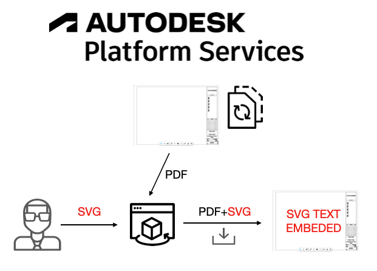
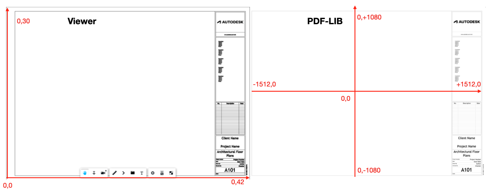
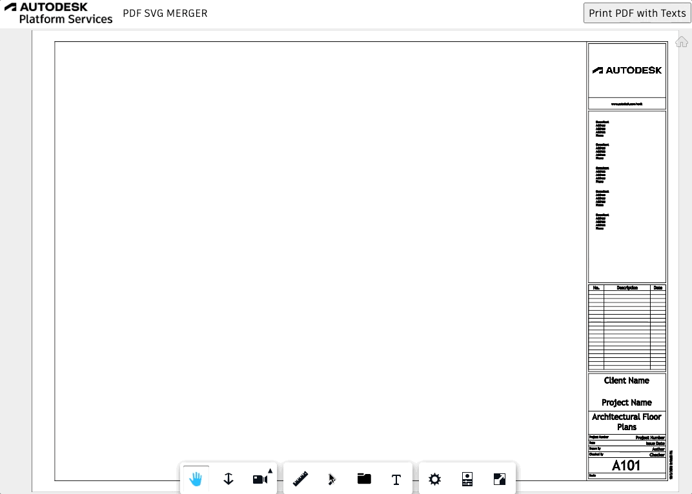
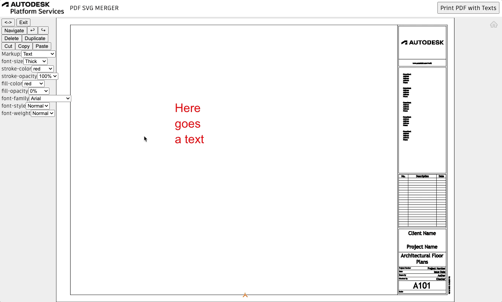

# aps-pdf-svg-merger

This sample shows a way to add SVGs on top of your PDF in Viewer and download the resulting file.

### DEMO:

### Introduction

When you submit a translation for a Revit 2022 file or later, it generates the 2D views as PDFs (refer [here](https://aps.autodesk.com/blog/advanced-option-rvtdwg-2d-views-svf2-post-job)).
The same can also happens for DWG 2D views, as explained in the previous blog.
We can take advantage of this fact to download these PDFs wherever they're available (Bucket, ACC, BIM 360...).
Also, if we combine this with a PDF library, such as [PDF-LIB](https://pdf-lib.js.org) we can even modify this PDF adding SVG on top of it.
That's what we'll cover in this sample.



### The approach

We are basically take advantage of three main resources to make this workflow possible:

1. PDF 2D views generated from Model Derivative
2. Markups extension
3. PDF-LIB project

First of all, we need to render the PDF sheet with Viewer and provide a way for the user to add SVGs on top of it.
Rendering 2D views is not different from rendering any regular design. For this sample we're passing the urn of a Revit file that only generated a sheet as derivative, but in case you need to select a 2D view dinamically, you can simply point to that urn and viewguid or have your user loading the view through [DocumentBrowser extension](https://aps.autodesk.com/en/docs/viewer/v7/reference/Extensions/DocumentBrowser/).

With the 2D view loaded, is time to provide our end user the hability to add SVG. The simplest way to achieve that is with `MarkupsCore` and `MarkupsGui` extensions, as done through the snippet below in Viewer's initialization:

```js
...
const config = {
  extensions: [
    "Autodesk.Viewing.MarkupsCore",
    "Autodesk.Viewing.MarkupsGui"
  ],
};
const viewer = new Autodesk.Viewing.GuiViewer3D(container, config);
...
```

**As of now, we're only handling addition of texts as SVG from Markups extension**

With that, once the user draws SVGs on top of our PDF, we'll use PDF-LIB to add these SVG's generating a new PDF file.
We can adapt [this documentation](https://pdf-lib.js.org/#modify-document) in order to add our texts from those generated with `Markups` extension.

The main challenge will be correctly positioning and specifying the correct sizes and colours of our fonts.

To properly specify the position, we'll have a logic to convert from Viewer coordinates to PDF-LIB coordinates



To address this compatibility, we have the code below:

```js
function addTextToPDFPage(textHTML, textLine, pdfPage, font) {
  // Get the width and height of the first page
  const { width, height } = pdfPage.getSize();

  //Offsets from the rectangle to the actual text added with Markupd extension
  let textOffsetX = parseFloat(textLine.getAttribute("x"));
  let textOffsetY = parseFloat(textLine.getAttribute("y"));

  let fontSize = parseFloat(textHTML.getAttribute("font-size"));
  //example: 'rgba(255,0,0,1)'
  let rgba = textHTML.getAttribute("fill");
  let red = parseFloat(rgba.split("(")[1].split(",")[0]) / 255;
  let green = parseFloat(rgba.split("(")[1].split(",")[1]) / 255;
  let blue = parseFloat(rgba.split("(")[1].split(",")[2]) / 255;
  //example: 'translate( 6.841478996503916 , 18.88096329583941 ) rotate( 0 ) scale(0.01,-0.01)'
  let transform = textHTML.getAttribute("transform");
  //Scale applied by Markups extension
  let scale = parseFloat(transform.split("scale(")[1].split(",")[0]);
  //Rotation applied by Markups extension
  let rotation = parseFloat(
    transform.split("rotate")[1].split("(")[1].split(")")[0]
  );
  //Position in Viewer coordinates
  let translateX = parseFloat(transform.split("(")[1].split(",")[0]);
  let translatey = parseFloat(
    transform.split("(")[1].split(",")[1].split(")")[0]
  );
  //Viewer max coordinates
  let modelMaxX = globalViewer.model.getData().modelSpaceBBox.max.x;
  let modelMaxY = globalViewer.model.getData().modelSpaceBBox.max.y;
  //Relative positioning of text in the sheet varying from 0 to 1
  let relativeX = (translateX + textOffsetX * scale) / modelMaxX;
  let relativeY = (translatey - textOffsetY * scale) / modelMaxY;
  //ratio PDF-LIB/Viewer units
  let ratio = width / modelMaxX;
  //Positioning of text in the sheet in PDF-LIB coordinates
  const finalX = -(0.5 * width) + width * relativeX;
  const finalY = -(0.5 * height) + height * relativeY;

  // Draw a string of text across the first page
  pdfPage.drawText(textLine.innerHTML, {
    x: finalX,
    y: finalY,
    size: fontSize * ratio * scale,
    font: font,
    color: rgb(red, green, blue),
    rotate: degrees(rotation),
  });
}
```

To test the workflow you'll need to first draw a text using Markup extension and then click the `Print PDF with Texts` button



And once downloaded you can check the resulting file



### Limitations

This sample code only reads the texts added on top of the 2D view.

For this workflow to work, your Revit file needs to be from version 2022 or later, and it needs to be published after November 4th of 2021.
This last restriction is because only after this date the extractor started adding the Revit version in the manifest (refer to [this blog](https://aps.autodesk.com/blog/check-version-revit-file-hosted-cloud)).

Also, for it to download the PDFs you might need to change your browser settings.

Here's the way to do it in Chrome
You can go to `Settings > Privacy and Security > Additional Content Settings > PDF documents > Download PDFs`

## Running locally

Clone this project or download it.
We recommend installing [GitHub desktop](https://desktop.github.com/).
To clone it via command line, use the following (**Terminal** on MacOSX/Linux, **Git Shell** on Windows):

    git clone https://github.com/autodesk-platform-services/aps-pdf-svg-merger

**Environment variables**

At the `.appsettings.Development.json`, find the env vars and add your APS Client ID, Secret and callback URL. The end result should be as shown below:

```json
  "APS_CLIENT_ID": "your APS app client id",
  "APS_CLIENT_SECRET": "your APS app client secret"
```

## License

This sample is licensed under the terms of the [MIT License](http://opensource.org/licenses/MIT). Please see the [LICENSE](LICENSE) file for full details.

## Written by

Joao Martins [@JooPaulodeOrne2](https://twitter.com/JooPaulodeOrne2), [Developer Advocate](http://aps.autodesk.com)
